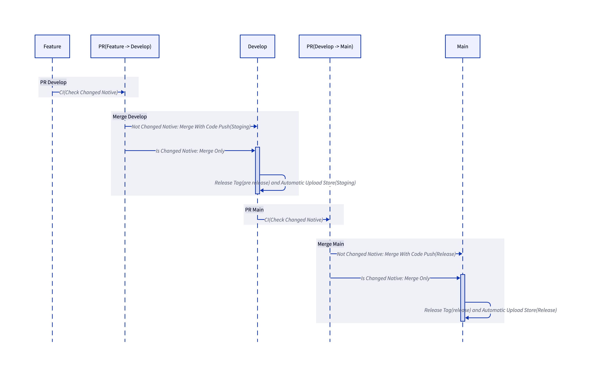
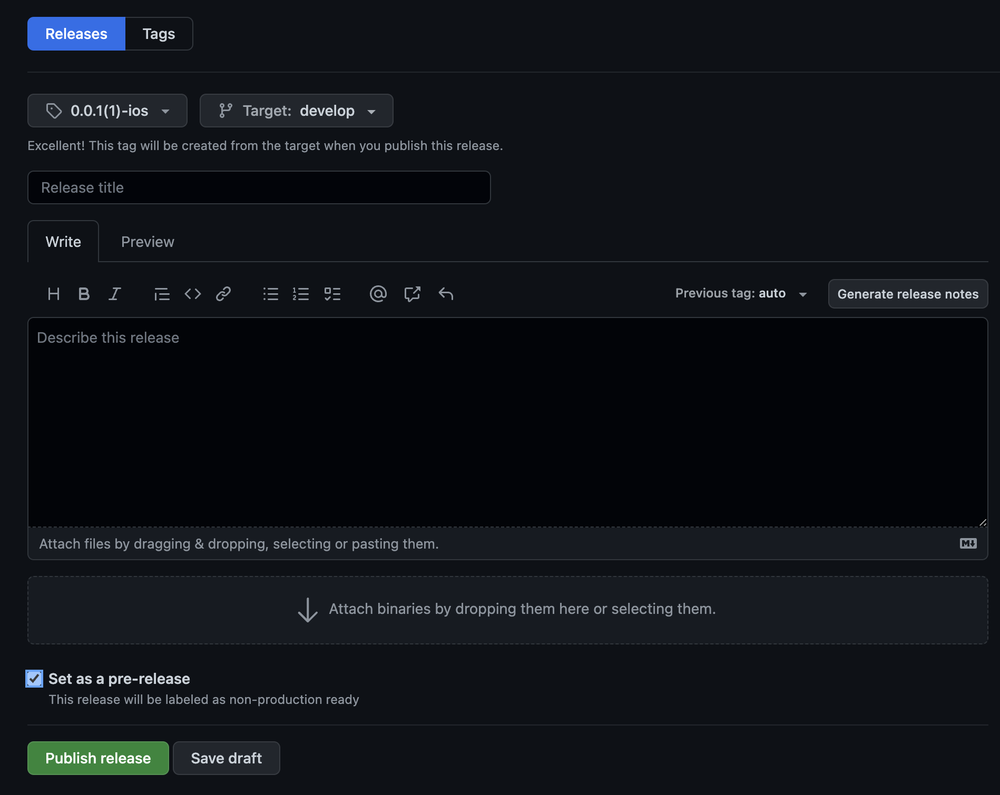

# ✅ Working Version

- node: '^16.0.0'
- npm: '7.10.0'
- yarn: '1.22.19'
- minSdkVersion: '21'
- compileSdkVersion: '31'
- ios: '15.2'
- android: '32'

# ReactNative starter1

Kick off your project with this boilerplate.

# 🚀 Quick Start

```bash
npx react-native init <Project Name> --template https://github.com/TOKTOKHAN-DEV/react-native-init.git
cd <Project Name>
yarn start
```

```new bash
yarn ios / yarn android
```

your app is now running at `http://localhost:8081`

# CI & CD

# Setting Github Action Environment

### Secret

- `APPCENTER_ACCESS_TOKEN`
- `AOS_ALIAS`
- `AOS_KEY_PASSWORD`
- `AOS_KEY_STORE_PASSWORD`
- `AOS_SERVICE_JSON`
- `AOS_SIGNING_KEY`
- `IOS_APPSTORE_API_KEY_ID`
- `IOS_APPSTORE_API_PRIVATE_KEY`
- `IOS_APPSTORE_ISSUER_ID`
- `IOS_CERTIFICATE_PASSWORD`
- `IOS_MOBILE_PROVISION_BASE64`

### Variable

- `IOS_APP_SCHEME`
- `AOS_PACKAGE_NAME`
- `CODE_PUSH_AOS_APP_NAME`
- `CODE_PUSH_IOS_APP_NAME`

# CI/CD



### 환경

`develop`: `Staging`  
`main`: `Release`

### CI

`develop`, `main` 브랜치에 `PR`이 생성되면 실행됩니다.

- 네이티브 변동이 있는지 체크합니다.

### CD

`develop`, `main` 브랜치에 `push`되면 실행됩니다.

- 네이티브 변동이 없으면 `Code Push`가 실행됩니다.
- 네이티브 변동이 있으면 아무것도 실행하지 않습니다.
  - 태그를 등록해 스토어로 업로드합니다. (아래 `Release Tag` 참고)

# Release Tag



### 태그 방식

`*.*.*(*)-(ios|aos)`

- `0.0.1(1)-ios`
- `0.0.1(1)-aos`

### 빌드 환경

환경에 따라 위 이미지의 `Set as a pre-release` 체크

- `develop`: true
- `main`: false

# 📁 Folder Structure

A quick look at the directories you'll see in this project.

### Root driectory layout

    .
    ├── apis                #
    ├── assets              #
    ├── components          #
    ├── constants           #
    ├── contexts            #
    ├── features            #
    ├── navigations         #
    ├── screens             #
    ├── script              #
    ├── style               #
    ├── utils               #
    ├── README.md           #
    └── ...

### screens

Each screens is associated with a route based on its file name.

    .
    ├── ...
    ├── screens
    │   ├── login.tsx
    │   ├── count.tsx
    │   └── ...
    └── ...

### Assets

ReactNative can serve static files, like images, fonts, ...

    .
    ├── ...
    ├── assets              #
    │   ├── splash.gif        #
    │   └── fonts
    │         └── ...
    └── ...

### Styles

Css, theme configuration files are placed into this folder.

    .
    ├── ...
    ├── styles              #
    │   ├── theme.tsx       #
    │   └── ...
    └── ...

### Api

Api call related functions.

### Components

Components are independent and reusable bits of code.

    .
    ├── ...
    ├── components          #
    │ ├── @Icons            # 아이콘~
    │ ├── @Layout           # 레이아웃~
    │ ├── Select            #
    │ ├── Calendar          #
    │ └── ...               #
    └── ...

### Container

Components are independent and reusable bits of code.

    .
    ├── ...
    ├── containers                  # containers에 하위 폴더들은 screens 1:1 매칭
    │ ├── login                     #
    │ │  ├── _fragments             # _fragment는 Login 페이지에서만 사용되는 컴포넌트
    │ │  │  ├── LoginForm.tsx       # 중복되는 경우에는 components 폴더로 이동
    │ │  │  └── Intro.tsx           #
    │ │  ├── Login.tsx              #
    │ │  ├── LoginContainer.tsx     # LoginContainer 에서 모든 로직에 대한 부분들 작업 (state, props)
    │ │  └── index.tsx              #
    │ ├── home                      #
    │ └── ...                       #
    └── ...

### Hooks

Custom hook allows you to extract some components logic into a reusable function that starts with use and that call can other hooks.

    .
    ├── ...
    ├── hooks                #
    │   ├── useScript.tsx    #
    │   └── ...
    └── ...

### Utils

Small snippets you can use throughout the application. Short and specific functions and constants used throughout application.

### Libs

Libraries you can use throughout the application. A library is a JavaScript file that contains a bunch of functions, and those functions accomplish some specific purpose.

    .
    ├── ...
    ├── libs                  #
    │   ├── gtm.ts            #
    │   └── ...
    └── ...

### Generated

Generated files such as apis, components, ...

    .
    ├── ...
    ├── generated         If you run generate-script, it will be created
    │ ├── apis            # by swagger-typescript-api
    │ ├── mock         # by orval
    └── ...

- **generate apis**

1. set config about gen_api on your .env
2. script

   > ```
   > npm(or yarn) run gen:api
   > ```

3. usage mock data

   > ```
   > mock-data-path: /generated/mock/[filename].msw
   > mock-data: Use Function "~Mock"
   > network-mocking: Use function "~MSW" and set on "_App.ts"
   > ```

   mock-data by [orval](https://orval.dev/reference/configuration/overview), [faker](https://github.com/faker-js/faker), [msw](https://mswjs.io/docs/getting-started/mocks/rest-api)
   api-data by [swagger-typescript-api](https://www.npmjs.com/package/swagger-typescript-api)

### Scripts

there is useful scripts in [package.json](package.json)

- **yarn run gen:api**
  - swagger => axios-api, react-hook, mock-data

see more [README.md](/src/scripts/README.md)

# 📛 Naming

### 👨‍🦳 React Component

- **Extensions:** Use .tsx extension for React components.

- **Filename:** Use PascalCase for filenames. E.g., ReservationCard.tsx.

- **Reference Naming:** Use PascalCase for React components and camelCase for their instances.

  ```tsx
  // bad
  import reservationCard from './ReservationCard';


  /
  import ReservationCard from './ReservationCard';


  //
  const ReservationItem = <ReservationCard />;


  // g
  const reservationItem = <ReservationCard />;
  ```

- **Component Naming:** Use the filename as the component name. For example, ReservationCard.tsx should have a reference name of ReservationCard. However, for root components of a directory, use index.tsx as the filename and use the directory name as the component name:

  ```tsx
  // bad
  import Footer from './Footer/Footer';

  // bad
  import Footer from './Footer/index';

  // good
  import Footer from './Footer';
  ```

### 🐪 Others

Always use camelCase for others.

- scripts
- folders
- variables
- functions

# ⭐️ Stack

- **State Management:** React Query, Context API, Redux-Toolkit
- **Styling:** Native-base, Emotion
- **Forms:** React Hook Form

# Reference

- [Folder-Structure-Conventions](https://github.com/kriasoft/Folder-Structure-Conventions/blob/master/README.md)
- [Airbnb React/JSX Style Guide - Naming](https://github.com/airbnb/javascript/tree/master/react#naming)
- [JavaScript Naming Conventions](https://www.robinwieruch.de/javascript-naming-conventions)
- [리액트 어플리케이션의 상태 관리하기](https://www.kenrhee.com/blog/react-application-state-management)
